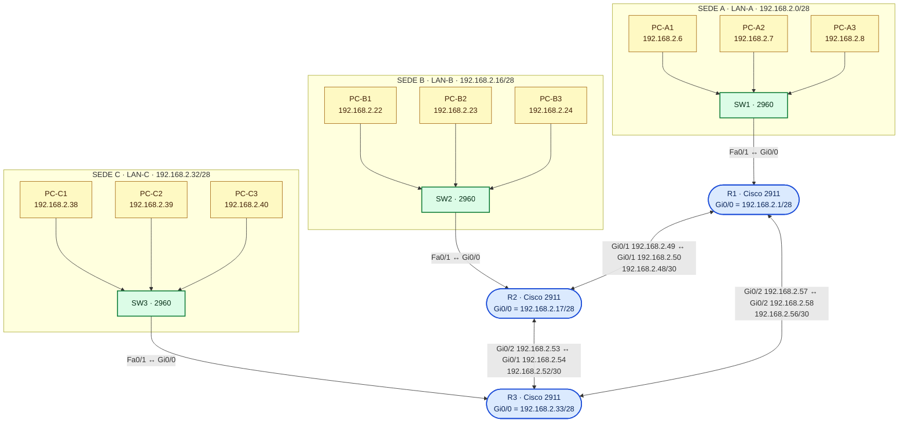
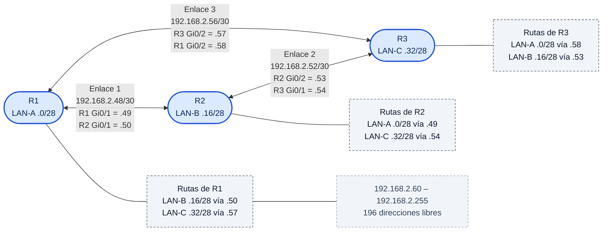
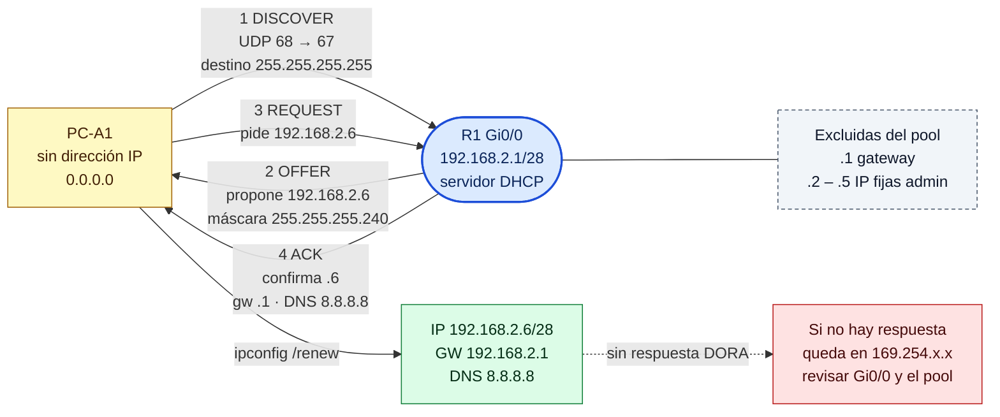
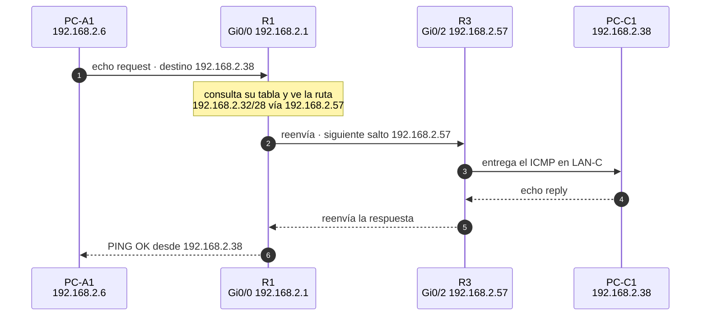
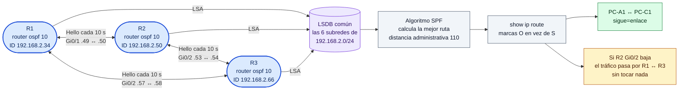

# Diagramas del laboratorio (Mermaid para draw.io)

Topología, direccionamiento y flujos del laboratorio **VLSM, DHCP y
enrutamiento** en 3 sedes, listos para insertar en **draw.io**.

## Cómo usarlos en draw.io

1. Abre draw.io (diagram.net) → **Arrange > Insert > Mermaid**
   (o el botón `+` de la barra → **Mermaid**).
2. Copia el bloque `mermaid` de este archivo y pégalo en el cuadro de texto.
3. En la lista inferior deja la opción **Diagram** (convierte a formas nativas de
   draw.io editables) o **Image** (SVG único).
4. Clic en **Insert**.

Para volver a editar el código: selecciona el grupo contenedor Mermaid y pulsa
**Enter** (o el icono del lápiz).

> Si tu versión de draw.io reporta un error de parseo al insertar, borra las
> líneas `classDef` y `class` de cada bloque: son **solo estilo** y el diagrama
> sigue siendo correcto sin ellas.

---

## 1. Topología física completa (estilo Packet Tracer)

Los 3 routers en malla, cada uno con su switch y sus 3 PCs. Muestra qué interfaz
conecta con qué y la subred de cada enlace.

## 2. Malla de enlaces punto a punto y subredes VLSM

Solo la capa 3 entre routers: cada `/30` con sus dos extremos y el siguiente salto
de cada ruta estática.

## 3. DHCP DORA — cómo un PC obtiene su IP

Flujo completo de la negociación entre un PC de LAN-A y el servidor DHCP que es
el propio router R1.

## 4. Recorrido de un paquete entre sedes

Traza de un `ping` de PC-A1 a PC-C1, que es el camino de 2 saltos directo de la
malla.

## 5. Convergencia de OSPF (Fase B)

Los 3 routers en área 0 intercambian hellos, sincronizan la LSDB y ejecutan el
algoritmo SPF. Con un enlace caído, el camino se recalcula solo.

---

## Resumen del plan (para rotular a mano en el diagrama)

| Subred | Uso | Prefijo | Gateway | Rango DHCP | Broadcast |
|--------|-----|---------|---------|-----------|-----------|
| 192.168.2.0/28 | LAN-A (R1) | 255.255.255.240 | .1 | .6 – .14 | .15 |
| 192.168.2.16/28 | LAN-B (R2) | 255.255.255.240 | .17 | .22 – .30 | .31 |
| 192.168.2.32/28 | LAN-C (R3) | 255.255.255.240 | .33 | .38 – .46 | .47 |
| 192.168.2.48/30 | R1 ↔ R2 | 255.255.255.252 | — | — | .51 |
| 192.168.2.52/30 | R2 ↔ R3 | 255.255.255.252 | — | — | .55 |
| 192.168.2.56/30 | R3 ↔ R1 | 255.255.255.252 | — | — | .59 |