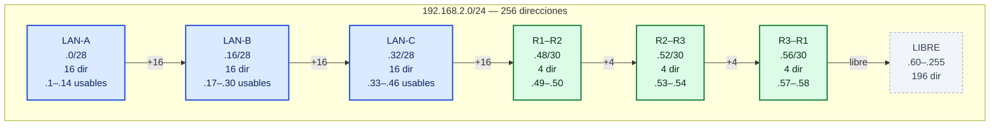
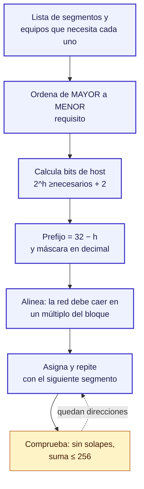

# Subneteo VLSM del laboratorio

Cálculo completo, desde cero, de las 6 subredes de `192.168.2.0/24` que usa este
laboratorio. Todo lo que sale aquí está reproducido después en los comandos IOS de
`config/R1.txt`, `config/R2.txt` y `config/R3.txt`.

Si solo quieres la tabla final, ve directo a
[la tabla de direccionamiento](README.md#tabla-de-direccionamiento-ip). Si quieres
aprender el método, sigue en orden.

---

## 1. Las tres reglas

| Regla | Fórmula | Para qué sirve |
|-------|---------|----------------|
| Hosts útiles | `2^h − 2` | Cuántas direcciones **asignables** tiene un bloque de `h` bits de host |
| Prefijo | `32 − h` | Bits que se dejan para la máscara |
| Alineación | La red debe caer en un **múltiplo del tamaño de bloque** | Evita subredes que se solapan |

**Por qué `−2`:** en cada subred, la primera dirección es la **dirección de red** y
la última es la **dirección de broadcast**. Ninguna de las dos se asigna a un
equipo. Por eso una `/29` (6 hosts útiles) no sirve para 10 equipos.

> **Ojo con el Trick de `−2`:** `2^h − 2` da los hosts útiles, pero para saber
> cuántos *bits de host* necesitas realmente hay que sumar esos 2:
> `2^h ≥ hosts + 2`. Con 10 hosts: `2^4 = 16 ≥ 12` ✓, y `2^3 = 8 < 12` ✗.

---

## 2. Requisitos del laboratorio

| Segmento | Equipos que necesita | Prefijo | Tamaño | Hosts útiles | Desperdicio |
|----------|-------------------|---------|--------|--------------|-------------|
| LAN-A | 10 | `/28` | 16 | 14 | 4 |
| LAN-B | 10 | `/28` | 16 | 14 | 4 |
| LAN-C | 10 | `/28` | 16 | 14 | 4 |
| Enlace P2P | 2 | `/30` | 4 | 2 | 0 |

**Desperdicio** = tamaño del bloque − 2 (red + broadcast) − hosts pedidos.
Por eso un `/30` para 2 equipos desperdicia **0**: es el bloque perfecto.

Esto es **VLSM** (máscaras de longitud variable): cada subred usa el prefijo
**más corto** que cumple su requisito. Un `/24` para las 6 subredas funcionaría
también, pero desperdiciaría el 75 % del espacio.

### ¿Por qué hay dos cálculos? Porque hay dos requisitos

No son "subnetear las LAN" y "subnetear los routers" por separado. Es **un solo
cálculo aplicado a seis segmentos**, y el resultado sale de dos tamaños distintos
porque hay dos necesidades distintas:

- **10 equipos** → 14 útiles → **`/28`** (3 LAN)
- **2 equipos** → 2 útiles → **`/30`** (3 enlaces)

La prueba de que el criterio **no es si el otro extremo es un switch o un
router**: R1 tiene las dos máscaras a la vez.

| Interfaz | Conecta con | Equipos que necesitan IP | Prefijo |
|----------|-------------|--------------------------|---------|
| `R1 Gi0/0` | SW1 (LAN) | 10 | `/28` |
| `R1 Gi0/1` | R2 (enlace) | 2 | `/30` |
| `R1 Gi0/2` | R3 (enlace) | 2 | `/30` |

Un mismo router con tres subredes y dos prefijos distintos. Lo que decide la
máscara es **cuántos dispositivos necesitan dirección en ese segmento**.

### ¿Por qué un enlace no puede ser `/28`? Sí podría, pero se desperdicia

Un `/28` en un enlace entre routers funcionaría (sobran 12 IPs). Pero como hay
3 enlaces, serían **36 direcciones tiradas** de las 256 del `/24`.

### ¿Por qué una LAN no puede ser `/30`? Porque sí se rompe

Con `/30` la LAN tendría solo 2 IPs útiles y el gateway consume una: queda **1
para los 9 PCs**. El primero no recibiría lease y los demás ni siquiera podrían
pedirlo.

**La asimetría:** sobre-asignar (dar `/28` a un enlace) funciona pero desperdicia;
sub-asignar (`/30` a una LAN) rompe el laboratorio. Por eso siempre se calcula
el **mínimo que cumple**, nunca más.

---

## 3. Elegir el prefijo de las LAN

Cada LAN necesita 10 equipos. Aplicando la regla con `h` bits de host:

```text
h = 1 →  2^1 − 2 =  2   ✗
h = 2 →  2^2 − 2 =  4   ✗
h = 3 →  2^3 − 2 =  6   ✗
h = 4 →  2^4 − 2 = 14   ✓  → cumple
```

El primero que cumple es `h = 4`, así que:

```text
prefijo = 32 − 4 = /28
```

**Un `/29` no alcanza** (6 hosts) y un `/27` sobra (30 hosts para 10 equipos,
20 desperdiciadas). `/28` es el único que cumple exactamente.

### Los 10 equipos de una LAN no son 10 PCs

El requisito de 10 se reparte así, y esto es lo que obliga a `/28`:

| Rol | Cuántos | Dirección |
|-----|---------|-----------|
| Gateway (interfaz LAN del router) | 1 | `.1` |
| IP fijas de administración (servidor, impresora, AP, NVR) | 4 | `.2` – `.5` |
| Clientes DHCP | ≥ 5 | `.6` – `.14` |

Los tres routers usan **9 IPs** del pool DHCP (3 PCs de ejemplo + 6 de reserva).
Con `/28` la LAN queda exactamente llena: `1 + 4 + 9 = 14`.

---

## 4. Elegir el prefijo de los enlaces punto a punto

Un enlace entre dos routers necesita **2** direcciones (una por extremo):

```text
2^h − 2 ≥ 2  →  h = 2  →  prefijo = /30
```

`/30` = bloque de 4 = red + 2 hosts + broadcast. Es la subred más pequeña
válida; una `/31` no existe en IPv4 tradicional y una `/32` es un loopback.

---

## 5. Las máscaras en binario

```text
/28 = 255.255.255.240 = 11111111.11111111.11111111.11110000
/30 = 255.255.255.252 = 11111111.11111111.11111111.11111100
                       └──────── 24 bits fijos ───────┘└─ 4 ─┘└─ 2 ─┘
```

Los bits de host a 0 marcan el **tamaño del bloque**: los 4 ceros finales del
`/28` equivalen a `2^4 = 16`; los 2 ceros del `/30`, a `2^2 = 4`.

---

## 6. Asignación de mayor a menor

Regla: se asigna **de mayor a menor** y cada bloque empieza en un múltiplo
exacto de su tamaño.

| # | Subred | Bloque | ¿Alineada? | Red | Hosts útiles | Broadcast | Uso |
|---|--------|--------|------------|-----|--------------|-----------|-----|
| 1 | `192.168.2.0/28` | 16 | 0 = 0×16 ✓ | `.0` | `.1` – `.14` | `.15` | LAN-A |
| 2 | `192.168.2.16/28` | 16 | 16 = 1×16 ✓ | `.16` | `.17` – `.30` | `.31` | LAN-B |
| 3 | `192.168.2.32/28` | 16 | 32 = 2×16 ✓ | `.32` | `.33` – `.46` | `.47` | LAN-C |
| 4 | `192.168.2.48/30` | 4 | 48 = 12×4 ✓ | `.48` | `.49` – `.50` | `.51` | R1 – R2 |
| 5 | `192.168.2.52/30` | 4 | 52 = 13×4 ✓ | `.52` | `.53` – `.54` | `.55` | R2 – R3 |
| 6 | `192.168.2.56/30` | 4 | 56 = 14×4 ✓ | `.56` | `.57` – `.58` | `.59` | R3 – R1 |
| — | `.60` – `.255` | — | — | — | — | — | **196 dir. libres** |

Consumo: `3×16 + 3×4 = 60` de 256 → **76 % libre** para crecer.

---

## 7. Reparto interno de cada LAN

Cada `/28` tiene 14 direcciones útiles y se reparten así (el patrón se repite en
las tres LAN, desplazado 16 y 32):

| LAN | Red | Gateway (fijo) | Fijas admin | Pool DHCP | Broadcast |
|-----|-----|----------------|-------------|-----------|-----------|
| LAN-A | `.0/28` | `.1` | `.2` – `.5` | **`.6` – `.14`** (9) | `.15` |
| LAN-B | `.16/28` | `.17` | `.18` – `.21` | **`.22` – `.30`** (9) | `.31` |
| LAN-C | `.32/28` | `.33` | `.34` – `.37` | **`.38` – `.46`** (9) | `.47` |

**Por qué el gateway va primero y se excluye del pool:** si un PC obtuviera la
IP del gateway, la LAN se aislaría en dos segmentos que no se hablan. Por eso
`.1` es siempre IP fija del router y nunca se entrega por DHCP.

---

## 8. Del cálculo a los comandos IOS

| Concepto de subneteo | Cómo se escribe en el router |
|----------------------|------------------------------|
| Dirección de una interfaz | `ip address 192.168.2.1 255.255.255.240` |
| Máscara de subred | `/28` → `255.255.255.240` (el prefijo se escribe en decimal) |
| Red del pool DHCP | `network 192.168.2.0 255.255.255.240` |
| Excluir el gateway y las fijas | `ip dhcp excluded-address 192.168.2.1 192.168.2.5` |
| Resumen de **todas** las subredes | `network 192.168.2.0 0.0.0.255` (en OSPF: wildcard) |

`255.255.255.240` es una `/28` y `0.0.0.255` es un `/24`: son prefijos distintos
en contextos distintos (máscara de interfaz vs. wildcard de OSPF).

**Verificación en Packet Tracer:** `show ip interface brief` debe mostrar las 3
interfaces con estado `up/up` y la IP correcta. Si una interfaz no sube, el
problema no es de subneteo sino de cableado o de `no shutdown`.

---

## 9. Los 6 bloques de un vistazo



---

## 10. El método en 6 pasos



---

## 11. Errores típicos

| Error | Por qué falla | Cómo se ve |
|-------|---------------|------------|
| Usar `/29` para una LAN | 6 hosts útiles < 10 | Faltan direcciones; el 4.º PC queda en `169.254.x.x` |
| Empezar la 2.ª LAN en `.15/28` | `.15` es el broadcast de LAN-A | La subred se solapa con la anterior |
| Poner un `/30` en `.46` | 46 no es múltiplo de 4 | IOS la rechaza: no alineada |
| Usar `.50/30` como red | `.50` es una dirección de host | Red con 2 bits de red inconsistentes |
| Olvidar excluir el gateway del pool | Un PC puede tomar `.1` | La LAN se parte en dos y nadie pingea |
| Poner la máscara como `/28` en `ip address` | Cisco espera decimal | Error de sintaxis |

---

## 12. Ejercicios

**1.** ¿Cuántos hosts útiles tiene `192.168.2.64/26`?

**2.** ¿Por qué `192.168.2.62/30` no es una subred válida?

**3.** Una LAN necesita 20 equipos. ¿Qué prefijo corresponde?

**4.** ¿Cuál es el rango DHCP de LAN-C y por qué empieza en `.38`?

**5.** ¿Cuántas direcciones quedan libres y a partir de cuál?

**6.** Un router tiene `ip address 192.168.2.33 255.255.255.252`. ¿Es coherente?

### Respuestas

1. `/26` → `h = 6` → `2^6 − 2 =` **62 hosts** útiles, bloque de 64.
2. Porque un `/30` exige que la red caiga en un múltiplo de 4, y **62 no lo es**
   (62/4 = 15.5). El `/30` válido sobre ese sector empieza en `.60`.
3. `2^5 − 2 = 30 ≥ 20` y `2^4 − 2 = 14 < 20` → `h = 5` → **`/27`**
   (255.255.255.224, bloque de 32, 30 hosts útiles).
4. **`.38` – `.46`** (9 IPs). `.33` es el gateway (fijo), `.34`–`.37` son las 4
   fijas de administración y `.47` es el broadcast, así que el pool arranca en
   `.38` y termina en `.46`.
5. **196 direcciones**, desde `.60` hasta `.255`. Es lo que queda tras gastar
   `3×16 + 3×4 = 60`.
6. **No.** `.33` es la dirección de red de `192.168.2.32/30`, no una dirección
   asignable; un host no puede tomar la dirección de red. Además, en este lab
   `.33` es el gateway de LAN-C con máscara `/28` (255.255.255.240).

---

## 13. Checklist antes de configurar

- [ ] Cada LAN con `/28` (6 hosts NO alcanzan).
- [ ] Cada enlace P2P con `/30`.
- [ ] Las 6 redes alineadas a múltiplos de su bloque (16 y 4).
- [ ] Gateway de cada LAN en la primera IP útil y **fuera** del pool DHCP.
- [ ] 4 IPs fijas de administración reservadas antes del rango DHCP.
- [ ] Las 3 redes de LAN consumen 48 direcciones y los 3 enlaces 12: 60 de 256.
- [ ] Las IPs de los CLI coinciden con esta tabla.

---

## Ver también

- [`README.md`](README.md) — índice del laboratorio y tabla de direccionamiento.
- [`SESION-A.md`](SESION-A.md) — Parte 2 pide resolver este cálculo a mano.
- [`DIAGRAMAS.md`](DIAGRAMAS.md) — topología y flujo DHCP en Mermaid.
- [`config/`](config/) — los tres CLI ya configurados con estos prefijos.
